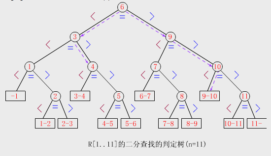
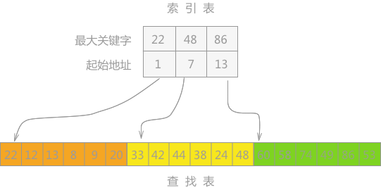
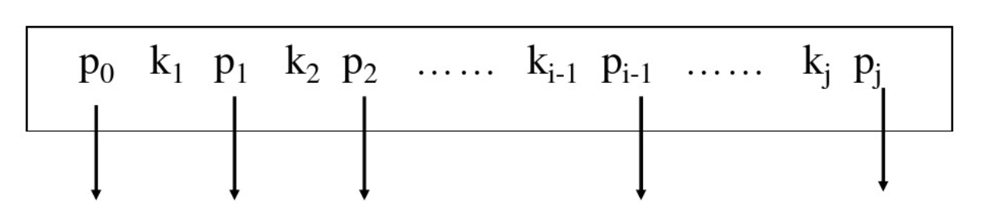
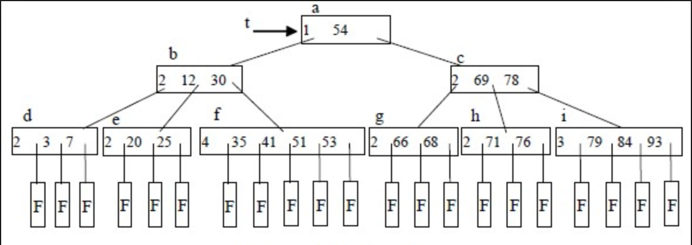

# 查找

## 一、查找的基本概念

1. 查找：在数据集合中寻找满足某种条件的数据元素的过程
2. 查找表：用于查找的数据集合，由同一种类型的数据元素或记录组成，可以是数组或链表
   1. 查询某个特定数据元素是否在查找表中
   2. 检索满足条件的某个特定的数据元素的各种属性
   3. 插入一个数据元素
   4. 删除某个数据元素
3. 静态查找表：查找表的操作只涉及上述的1和2，无须动态地修改查找表。使用的查找方法：顺序查找、折半查找、散列查找
4. 动态查找表：二叉平衡数、B树
5. 关键字：数据元素中唯一标识该元素的某个数据项的值，查找结构应该是唯一的
6. 平均查找长度：一次查找长度是指需要比较的关键字的次数，平均查找长度是所有查找过程中进行关键字的比较次数的平均值

## 二、顺序查找和折半查找

### 2.1 顺序查找

#### 一般线性表的顺序查找

基本思想是从线性表的一端开始，逐个检查关键字是否满足给定的条件

```text
typedef struct{
    ElemType *elem;
    int      TableLenl
}SSTable
int Search_Seq(SSTable ST, ElemType key){
    ST.elem[0]=key;
    for(i=ST.TableLen;ST.elem[i]!=key;--i);
    return i;
}
```

将ST.elem\[0\]称为哨兵，作用是使得for内的循环不必判断数组是否会越界

#### 有序表的顺序查找

如果在查找前就知道表是按关键字有序的，那么当查找失败时可以不用再比较到表的另一端就能返回查找失败的信息，能降低顺序查找失败的平均查找长度

### 2.2 折半查找

基本思路：首先将给定值key与表中中间位置元素的关键字比较，若相等则查找成功，返回该元素的位置；若不等，则所需查找的元素只能在中间元素以外的前半部分或后半部分中

```text
int Binary_Search(SeqList L, ElemType key){
    int low=0,high=L.TableLen-1,mid;
    while(low<=high){
        mid=(low+high)/2;
        if(L.elem[mid]==key)
            return mid;
        else if(L.elem[mid]>key)
            low=mid+1;
        else
            high=mid-1;
    }
    return -1;
}
```



### 2.3 分块查找

基本思想：将查找表分为若干个子块，块内的元素可以乌苏，但块之间是有序的。再建立一个索引表，索引表中的每个元素含有各块的最大关键字和各块中第一个元素的地址，索引表按关键字有序排列。过程第一步在索引表中确定待查记录所在块，可以顺序查找或折半查找索引表；第二部在块内顺序查找



## 三、B树和B+树

### 3.1 B树及其基本操作

B树又称多路平衡查找树，一棵m阶B树或为空树，或为满足如下特性的m叉树：

1. 树中每个结点至多由m棵子树
2. 若根结点不是终端结点，则至少由两棵子树
3. 除根结点外的所有非叶结点至少由\[m/2\]棵子树
4. 非叶结点的关键字满足k1&lt;k2&lt;...&lt;kn，pi为指向子树根结点的指针，n\(ceil\(m/2\)-1&lt;=n&lt;=m-1\)为结点中关键字个数   
5. 所有叶结点都出现在同一层次上，并且不带信息



#### B树的查找

B树的查找包含两个基本操作：1.在B树中找结点；2.在结点内找关键字。由于B树常存储在磁盘上，则前一个操作实在磁盘上进行的，而后一个操作实在内存中进行的，即在找到目标结点后，先将结点中的信息读入内存，然后再采取顺序查找或折半查找法查找等于K的关键字。

#### B树的插入

1. 定位：利用B树的查找法，找出插入该关键字的最底层中某个非叶结点
2. 插入：在B树中，每个非失败结点的关键字个数都在\[ceil\(m/2\)-1, m-1\]之间。当插入后的结点关键字个数小于m，则可以直接插入；否则进行分裂
3. 分裂的方法：取一个新结点，将插入key后的原籍诶但从中间位置将其中的关键字分为两部分，左部分包含的关键字放在原结点中，右部分包含的关键字放到新结点中，中间位置\(ceil\(m/2\)\)的结点插入到原结点的父结点中。若此时导致其父结点的关键字个数也超过了上线，则继续进行分裂，知道这个过程传到根结点为止，导致B树高度加1


#### B树的删除

当所删除的关键字k不再终端结点（最底层非叶结点）中时，有下列几种情况：

1. 如果小于k的子树中关键字个数&gt;ceil\(m/2\)-1，则找出k的前驱k\`，并且用k\`来取代k，再递归地删除k\`即可
2. 如果大于k的子树中关键字个数&gt;ceil\(m/2\)-1，则找出k的后继k\`，并且用k\`来取代k，再递归地删除k\`即可
3. 如果前后两个子湖中关键字个数均为ceil\(m/2\)-1，则直接合并

当被删除的关键字在终端结点（最底层非叶结点）时，有下列几种情况：

1. 直接删除关键字：被删除关键字所在结点的关键字个数&gt;ceil\(m/2\)-1
2. 兄弟够借：若被删除关键字所在结点删除前的关键字个数=ceil\(m/2\)-1，且与此结点相邻的左\(右\)兄弟结点的关键字个数&gt;=ceil\[m/2\]
3. 兄弟不够借：若被删除关键字所在结点删除前的关键字个数=ceil\(m/2\)-1，且与此结点相邻的左\(右\)兄弟结点的关键字个数=ceil\[m/2\]-1，则将关键字删除后与左\(右\)兄弟及双亲结点中的关键字进行合并\(有递归过程\)

