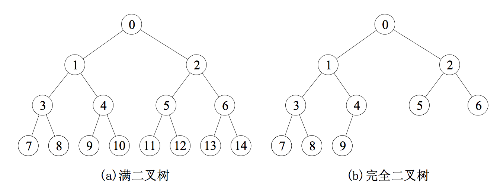

# 树和二叉树

## 一、树的基本概念

### 1.1 树的定义

树是N（N>=0）个结点的有限集合，N=0时，称为空树。在任意一棵非空树中应满足：

1. 有且仅有一个特定的称为根的结点
2. 当N>1时，其余结点可分为m（m>0）个互不相交的有限集合T1，T2，……，Tm，其中每一个集合本身又是一棵树，并且称为根结点的子树

### 1.2 基本性质

* 树中的结点树等于所有结点的度数加1
* 度为m的树中第i层上至多有m^\(i-1\)个结点
* 高度为h的m叉树至多有\(m^h-1\)/\(m-1\)个结点
* 具有n个结点的m叉树的最小高度为log\_m\(n\(m-1\)-1\)

## 二、二叉树的概念

### 2.1 二叉树的定义及其主要性质

#### 二叉树的定义

二叉树是另一种树形结构，特点是每个结点至多只有两棵子树，并且二叉树的子树有左右之分。与树相似，二叉树也以递归的形式定义，是n（n>=0）个结点的有限集合。


二叉树与度为2的有序树的区别：

1. 度为2的树至少有3个结点，而二叉树可以为空
2. 度为2的有序树中，如果某个结点只有一个孩子结点，这个孩子结点就无须区分左右次序

#### 几个特殊的二叉树

* 满二叉🌲：树中每一层都含有最多的结点。可以对其按层序编号，约定编号从根结点（编号为1）起，从上而下，自左向右。这样对于编号为i的结点，如果有双亲则为i/2，如果有左右孩子，则左孩子为2i，右孩子为2i+1



* 完全二叉🌲：高度为h，有n个结点的二叉树，当且仅当其每一个结点都与高度为h的满二叉树中编号为1～n的结点一一对应时，称为完全二叉树，性质如下：
  * 如果有度为1的结点，只可能有一个，且该结点只有左孩子（重要特征）
  * 一旦出现某结点为叶子结点或只有左孩子，则编号大于该结点的均为叶子结点
  * n为奇数，则每个分之结点都有左孩子和右孩子；n为偶数，则编号最大的分支（编号为n/2）只有左孩子
* 二叉排序🌲：一棵二叉树或者是空子树，或者是具有如下性质的二叉树：左子树上所有的结点值均小于根结点的值；右子树上左右的结点值均大于根结点值。左子树和右子树又各是一棵二叉排序树
* 平衡二叉🌲：树上任一结点的左子树和右子树的深度之差不超过1

#### 二叉树的性质

1. 非空二叉树上的叶子结点树等于度为2的结点树加1
2. 非空二叉树上第K层上至多有2^\(k-1\)个结点
3. 高度为H的二叉树至多有2^h-1个结点
4. 具有N个（N>0）结点的完全二叉树的高度为

$$
log_2(N+1)或log_2N+1
$$

### 2.2 二叉树的存储结构

#### 顺序存储结构

用一组地址连续的存储单元依次从上而下、从左至右存储完全二叉树上的结点元素。但对于一般的二叉树，为了让数组下标能反映二叉树中结点之间的逻辑关系，只能添加一些并不存在的空结点让其每个结点与完全二叉树上的结点相对照，再存储到一维数组的相应分量中

#### 链式存储结构

```text
typedef struct BiTNode{
    ElemType data;
    struct BiTNode *lchild, *rchild;
}BiTNode, *BiTree;
```

## 三、二叉树的遍历和线索二叉树

### 3.1 二叉树的遍历

#### 先序遍历

```text
void PreOrder(BiTree T){
    if(T!=NULL){
        vistit(T);            //访问根结点
        PreOrder(T->lchild);  //递归遍历左子树
        PreOrder(T->rchild);  //递归遍历右子树
    }
}
```

#### 中序遍历

```text
void InOrder(BiTree T){
    if(T!=NULL){
        InOrder(T->lchild);  //递归遍历左子树
        visit(T);            //访问根结点
        InOrder(T->rchild);  //递归遍历右子树
    }
}
```

#### 后序遍历

```text
void PostOrder(BiTree T){
    if(T!=NULL){
        PostOrder(T->rchild);
        PostOrder(T->lchild);
        visit(T);
    }
}
```

不管采用哪种遍历算法，每个结点都有且访问依次，故时间复杂度都为O\(n\)。在最坏情况下，二叉树是有n个结点且深度为n的单支树，遍历算法空间复杂度为O\(n\)。

#### 递归算法和非递归算法的转换

借助栈，将二叉树的递归算法转换为非递归算法，下面以中序遍历为例。先扫描（非访问）根结点的所有做结点并将它们一一入栈。然后出栈一个结点\*p（无左孩子或左孩子均已访问过），则访问它。然后扫描该结点的右孩子结点，进栈，再扫描右孩子结点的左结点并入栈，直至栈空

```text
void InOrder2(BiTree T){
    InitStack(S);
    BiTree p=T;
    while(p||!IsEmpty(S)){
        if(p){                //根指针进栈，遍历左子树
            Push(p, S);
            p=p->lchild;
        }else{                //根指针退栈，访问根结点，遍历右子树
            Pop(S, p);
            visit(p);
            p=p->rchild;      //向右子树走
        }
    }
}
```

显然非递归算法的执行效率高于递归算法

#### 层次遍历

要进行层次遍历需要借助一个队列。先将二叉树根结点入队，然后出队，访问该结点，然后将左右子树根结点入队（如果有），然后出队，直至队列为空

```text
void LevelOrder(BiTree T){
    InitQueue(Q);
    BiTree p;
    EnQueue(Q, T);
    while(!IsEmpty(Q)){
        DeQueue(Q, p);
        visit(p);
        if(p->lchild!=NULL)
            EnQueue(Q, p->lchild);
        if(p->rchild!=NULL)
            EnQueue(Q, p->rchild);
    }
}
```

