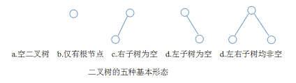

# 树和二叉树

## 一、树的基本概念

### 1.1 树的定义

树是N（N&gt;=0）个结点的有限集合，N=0时，称为空树。在任意一棵非空树中应满足：

1. 有且仅有一个特定的称为根的结点
2. 当N&gt;1时，其余结点可分为m（m&gt;0）个互不相交的有限集合T1，T2，……，Tm，其中每一个集合本身又是一棵树，并且称为根结点的子树

### 1.2 基本性质

* 树中的结点树等于所有结点的度数加1
* 度为m的树中第i层上至多有m^\(i-1\)个结点
* 高度为h的m叉树至多有\(m^h-1\)/\(m-1\)个结点
* 具有n个结点的m叉树的最小高度为log\_m\(n\(m-1\)-1\)

## 二、二叉树的概念

### 2.1 二叉树的定义及其主要性质

#### 二叉树的定义

二叉树是另一种树形结构，特点是每个结点至多只有两棵子树，并且二叉树的子树有左右之分。与树相似，二叉树也以递归的形式定义，是n（n&gt;=0）个结点的有限集合。

二叉树与度为2的有序树的区别：

1. 度为2的树至少有3个结点，而二叉树可以为空
2. 度为2的有序树中，如果某个结点只有一个孩子结点，这个孩子结点就无须区分左右次序

#### 几个特殊的二叉树

* 满二叉🌲：树中每一层都含有最多的结点。可以对其按层序编号，约定编号从根结点（编号为1）起，从上而下，自左向右。这样对于编号为i的结点，如果有双亲则为i/2，如果有左右孩子，则左孩子为2i，右孩子为2i+1

* 完全二叉🌲：高度为h，有n个结点的二叉树，当且仅当其每一个结点都与高度为h的满二叉树中编号为1～n的结点一一对应时，称为完全二叉树，性质如下：
  * 如果有度为1的结点，只可能有一个，且该结点只有左孩子（重要特征）
  * 一旦出现某结点为叶子结点或只有左孩子，则编号大于该结点的均为叶子结点
  * n为奇数，则每个分之结点都有左孩子和右孩子；n为偶数，则编号最大的分支（编号为n/2）只有左孩子
* 二叉排序🌲：一棵二叉树或者是空子树，或者是具有如下性质的二叉树：左子树上所有的结点值均小于根结点的值；右子树上左右的结点值均大于根结点值。左子树和右子树又各是一棵二叉排序树
* 平衡二叉🌲：树上任一结点的左子树和右子树的深度之差不超过1

#### 二叉树的性质

1. 
