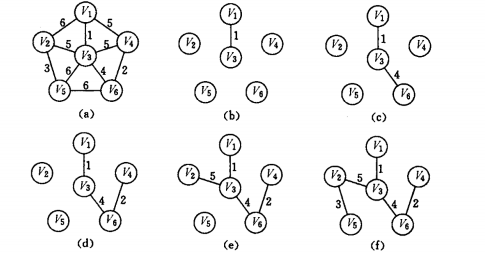

# 图

## 一、图的基本概念

图G由顶点集V和边集E组成，记成G=\(V, E\)，其中V\(G\)表示图G中顶点的有限非空集；E\(G\)表示图G中顶点之间的关系（边）集合

1. 有向图：若E是有向边的有限集合时，图G为有向图。E={&lt;1, 2&gt;, &lt;2, 1&gt;, &lt;1, 3&gt;}
2. 无向图：若E是无向边的有限集合时，图G为无向图。E={\(1, 2\), \(1, 3\), \(2, 3\)}
3. 完全图：在无向图中，如果任意两个顶点之间都存在边，则称图G为无向完全图；在有向图中，如果任意两个顶点之间都存在方向相反的两条弧，则称图G为有向完全图
4. 子图：若有满足V\(G1\)=V\(G\)的子图G1，则为G的生成子图

   ⚠️：E的子集中的某些关联的顶点可能不再这个V的子集中

5. 连通、连通图和连通分量：
   1. 在无向图中，若从顶点v到顶点w有路径存在，则称v和w是连通的
   2. 若图G中任意两个顶点都是连通的，则称图G为连通图。若图有n个顶点，并且有小于  n-1条边，则此图必是非连通图
   3. 无向图中的极大连通子图称为连通分量
6. 强连通图、强连通分量：
   1. 在有向图中，若从顶点v到w和从w到v之间都有路径，则称这两个顶点强连通
   2. 若图中任意一对顶点都是强连通的，则称此图为强连通图
   3. 有向图中的极大连通子图称为强连通分量
7. 生成树、生成森林：
   1. 连通图的生成树是包含图中全部顶点的一个极小连通子图。若图中顶点数为n，则它的生成树含有n-1条边
   2. 对生成树而言，砍去它的一条边，变成非连通图，加上一条边则形成回路
   3. 在非连通图中，连通分量的生成树构成了生成森林
8. 顶点的度、入度和出度：
   1. 对于无向图，顶点v的度是指依附与该顶点的边的条数，记为TD\(V\)；在具有n个顶点e条边的无向图中，全部顶点度之和为2e
   2. 对于有向图，顶点v的度分为入度和出度，记为TD\(v\)=ID\(v\)+OD\(v\)；在具有n个顶点e条边的有向图中，全部顶点的入度之和=出度之和=e
9. 边的权和网：在图中，每条边都可以标上具有某种含义的数值，该数值称为该边的权值。这种边上带有权值的图称为带权图，也称作网
10. 稠密图、稀疏图：一般当图G满足\|E\|&lt;\|V\|\*log\|V\|时，看成是稀疏图
11. 路径、路径长度和回路：
    1. 路径：顶点vp到顶点vq之间的一条顶点序列
    2. 路径长度：路径上边的数目
    3. 回路（环）：第一个顶点和最后一个顶点相同的路径。若一个图有n个顶点，并且有大于n-1条边，则此图一定有环
12. 简单路径、简单回路：顶点不重复的路径；除第一个顶点和最后一个顶点之外，其余顶点不重复出现的回路
13. 距离：从顶点u出发到顶点v的最短路径若存在，则称为距离，否则距离为∞
14. 有向树：有一个顶点的饿入度为0，其余顶点的入度均为1的有向图称为有向树

## 二、图的存储及基本操作

### 2.1 邻接矩阵法

用一个一维数组存储图中顶点的信息，用一个二维数组存储图中边的信息，称为邻接矩阵。结点数为n的图G的邻接矩阵A是n\*n。将G的顶点编号为v1, v2, ……, vn，若\(vi, vj\)∈E，则A\[i\]\[j\]=1，否则A\[i\]\[j\]=0。对于带权图而言，邻接矩阵中对应项存放这该边对应的权值，若顶点不相连，则用∞来表示


```text
#define MaxVertexNum 100
typedef char VertexType;
typedef int EdgeType;
typedef struct{
    VertexType Vex[MaxVertexNum];
    EdgeType Edge[MaxVertexNum][MaxVertexNum];
    int vexnum, arcnum;                        //图的当前顶点数和弧数
}MGraph;
```

### 2.2 邻接表法

当一个图为稀疏图时，使用图的邻接表法。顶点表结点由顶点域\(data\)和指向第一条邻接边的指针\(firstarc\)构成，边表\(邻接表\)结点由邻接点域\(adjvex\)和指向下一条邻接边的指针域\(nextarc\)构成


```text
#define MaxVertexNum 100
typedef struct ArcNode{
    int adjvex;
    struct ArcNode *next;
}ArcNode;
typedef struct VNode{
    VertexType data;
    ArcNode *first;
}VNode, AdjList[MaxVertexNum];
typedef struct{
    AdjList vertices;
    int vexnum, arcnum;
}ALGraph;
```

### 2.3 十字链表

十字链表是有向图的一种链式存储结构。在十字链表中，对应有向图中的每条弧有一个结点，对应于每个顶点也有一个结点。hlink指向弧头相同的下一条弧，tlink指向弧尾相同的下一条弧


```text
#define MaxVertexNum 100
typedef struct ArcNode{
    int vailvex, headvex;
    struct ArcNode *hlink, *tlink;
}ArcNode;
typedef struct VNode{
    VertexType data;
    ArcNode *fitstin, *firstout;
}VNode;
typedef struct{
    VNode xlist[MaxVertexNum];
    int vexnum, arcnum;
}GLGraph;
```

### 2.4 邻接多重表

邻接多重表是无向图的另一种链式存储结构


```text
#define MaxVertexNum 100
typedef struct ArcNode{
    bool mark;
    int ivex, jvex;
    struct ArcNode *ilink, jlink;
}ArcNode;
typedef struct VNode{
    VertexType data;
    ArcNode *firstedge;
}VNode;
typedef struct{
    VNode adjmulist[MaxVertexNum];
    int vexnum, arcnum;
}AMLGraph;
```

### 2.5 图的基本操作

* Adjacent\(G, x, y\)：判断图G是否存在边&lt;x, y&gt;或\(x, y\)
* Neighbors\(G, x\)：列出图G中与结点x邻接的边
* InsertVertex\(G, x\)：在图G中插入结点x
* DeleteVertex\(G, x\)：在图G中删除顶点x
* AddEdge\(G, x, y\)：如果无向边\(x, y\)或有向边&lt;x, y&gt;不存在，则添加此边
* RemoveEdge\(G, x, y\)：如果无向边\(x, y\)或有向边&lt;x, y&gt;存在，则删除此边
* FirstNeighbor\(G, x\)：求图G中顶点x的第一个邻接点，若有则返回顶点号，否则返回-1
* NextNeighbor\(G, x, y\)：假设图G中y是顶点x的一个邻接点，返回除y之外顶点x的下一个邻接点的顶点好，若y是x的最后一个邻接点，返回-1
* Get\_edge\_value\(G, x, y\)：获取图G中边\(x, y\)或&lt;x, y&gt;对应的权值
* Set\_edge\_value\(G, x, y, v\)：设置图G中边\(x, y\)或&lt;x, y&gt;对应的权值为v

## 三、图的遍历

### 3.1 广度优先搜索—BFS

广度优先搜索是一种分层查找过程，每向前走一步可能访问一批顶点。为了实现逐层的访问，算法必须借助一个辅助队列，以记忆正在访问的顶点的下一层顶点

```text
bool visited[MAX_VERTEX_NUM];
void BFSTraverse(Graph G){
    for(i=0; i<G.vexnum; i++)
        visited[i]=FALSE;
    InitQueue(Q);
    for(i=0; i<G.vexnum; i++)
        if(!visited[i])    BFS(G, i);
}
void BFS(Graph G, int v){
    visit(v);
    visited[v]=TRUE;
    EnQueue(Q, v);
    while(!isEmpty(Q)){
        DeQueue(Q, v);
        for(w=FirstNeighbor(G, v); w>=0; w=NextNeighbor(G, v, w))
            if(!visited[w]){
                visit(w);
                visited[w]=TRUE;
                EnQueue(Q, w);
            }
    }
}
```

#### BFS性能分析

需要借助一个辅助队列Q，n个顶点均需入队一次，最坏情况下空间复杂度为O\(\|V\|\)。

* 当采用邻接表储存法时，每个顶点均需搜索一次，时间复杂度为O\(\|V\|\)，当搜索任一顶点的邻接点时，每条边至少访问一次，时间复杂度为O\(\|E\|\)，总时间复杂度为O\(\|V\|+\|E\|\)
* 当采用邻接矩阵存储法时，查找每个顶点的邻接点所需时间为O\(\|V\|\)，故总时间复杂度为O\(\|V\|\*\|V\|\)

#### BFS算法求解单源最短路径问题

如果图G\(V, E\)为非带权图，定义从顶点u到顶点v的最短路径d\(u, v\)为u到v的任何路径中最少的变数；如果从u到v没有通路，则d\(u, v\)=∞

```text
void BFS_MIN_Distance(Graph G, int u){
    for(i=0; i<G.vexnum; i++)
        d[i]=∞;
    visited[u]=TRUE; d[u]=0;
    EnQueue(Q, u);
    while(!isEmpty(Q)){
        DeQueue(Q, u);
        for(w=FirstNeighbor(G, u);w>=0;w=NextNeighbor(G, u, w))
            if(!visited[w]){
                visited[w]=TRUE;
                d[w]=d[u]+1;
                EnQueue(Q, w);
            }
    }
}
```

### 3.2 深度优先搜索

```text
bool visited[MAX_VERTEX_NUM];
void DFSTraverse(Graph G){
    for(v=0;v<G.vexnum;v++)
        visited[v] = FALSE;
    for(v=0;v<G.vexnum;v++)
        if(!visited[v])
            DFS(G, v);
}
void DFS(Graph G, int v){
    visit(v);
    visited(v)=TRUE;
    for(w=FirstNeighbor(G, v);w>=0;w=NextNeighbor(G, v, w))
        if(!visited[w])
            DFS(G, w);
}
```

#### DFS算法性能分析

DFS算法是递归算法，需要借助一个递归工作栈，空间复杂度为O\(\|V\|\)

* 当以邻接矩阵表示时，查找每个顶点的邻接点需要时间O\(\|V\|\)，故总的时间复杂度为

  O\(\|V\|\*\|V\|\)

* 当采用邻接表储存法时，每个顶点均需搜索一次，时间复杂度为O\(\|V\|\)，当搜索任一顶点的邻接点时，每条边至少访问一次，时间复杂度为O\(\|E\|\)，总时间复杂度为O\(\|V\|+\|E\|\)

### 3.3 图的遍历和图的连通性

图的遍历算法可以判断图的连通性

* 若无向图是连通的，则从任一结点出发，仅需要一次遍历就能访问所有顶点
* 若无向图是非连通的，则从某一顶点出发，一次遍历只能访问到该顶点所在连通分量的所有顶点
* 对有向图而言，若从初始点到图中的每个顶点都有路径，则能访问所有顶点

故而在BFSTraverse\(\)或DFSTraverse\(\)中添加了第二个for循环，再选择初始点，继续进行遍历。对无向图，上述函数调用BFS\(G, i\)或DFS\(G, i\)的次数等于该图的连通分量个数

## 四、图的应用

### 4.1 最小生成树

一个连通图的生成树是图的极小连通子图，它包含图中所有顶点，并且只含尽可能少的边。对于生成树来说，砍去一条边，会使树变成非连通图；增加一条边，会形成图中的一跳回路

对于一个带权连通无向图G=\(V, E\)，生成树不同，每棵树的权也可能不同。设R为G的所有生成树的集合，若T为R中边的权值之和最小的那棵生成树，则T称为G的最小生成树，性质如下：

1. 当图中各边的权值互不相等时，G的最小生成树唯一；若无向连通图G的边比顶点数少1，G的最小生成树为它本身
2. 虽然最小生成树不唯一，但其对应的边的权值之和总是唯一且最小的
3. 最小生成树的变数为顶点数减1

```text
//算法利用性质：设G=(V, E)是一个带权连通无向图，U是顶点集V的一个非空子集。若(u,v)是
//一条具有最小权值的边，其中u∈U，v∈V-U，则必存在一棵包含边(u,v)的最小生成树
GENERIC_MST(G){
    T = NULL;
    while T 未形成一棵生成树;
        do 找到一条最小代价边(u,v)并且加入T后不会产生回路;
            T=T∪(u,v);
}
```

#### 普里姆（Prim）算法


```text
void Prim(G, T){
    T=Ø;
    U={w};            //添加任一顶点w
    while((V-U)!=Ø){
        设(u,v)是使u∈U与v∈V-U，且权值最小的边;
        T=T∪{(u,v)};
        U=U∪{v};
    }
}
```



#### 克鲁卡尔（Kruskal）算法


```text
void Kruskal(V, T){
    T=V            //初始化T，仅含顶点
    numS=n;        //连通分量数
    while(numS>1){
        从E中取出权值最小的边;
        if(u和v属于T中不同的连通分量){
            T=T∪{(u,v}
            numS--;
        }
    }
}
```


