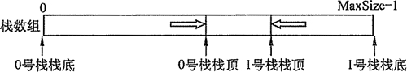
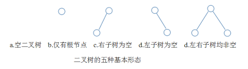
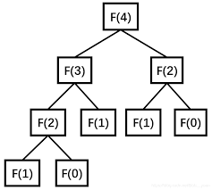
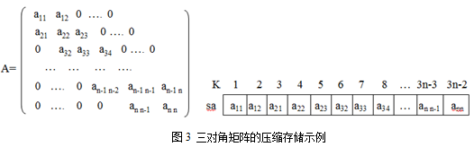
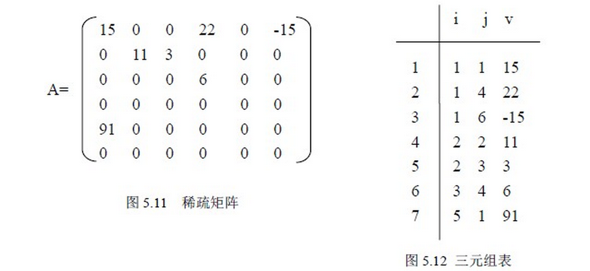

# 栈和队列

## 一、栈

### 1. 栈的基本概念

#### 1.1栈的定义

* 栈：只允许在一端进行插入或删除操作的线性表
* 栈顶：线性表允许插入和删除的那一端
* 栈底：不允许进行插入和删除的另一端
* 空栈：不含任何元素的空表

#### 1.2 栈的基本操作

* InitStack\(&S\)：初始化一个空栈
* StackEmpty\(S\)：判断一个栈是否为空，返回布尔值
* Push\(&S, x\)：进栈，若栈S未满，则将x加入使之成为新栈顶
* Pop\(&S, &x\)：出栈，若栈S非空，弹出栈顶元素，用x返回
* GetTop\(S, &x\)：读栈顶元素，若栈S非空，用x返回栈顶元素
* ClearStack\(&S\)：销毁栈

### 2. 栈的顺序存储结构

#### 2.1 顺序栈的实现

栈的顺序存储称为顺序栈，它利用一组地址连续的存储单元存放自栈底到栈顶的数据元素，同时附设一个指针（Top）指示当前栈顶的位置

```text
#define MaxSize 50
typedef struct{
    Elemtype data[MaxSize];    //存放栈中元素
    int top;                   //栈顶指针
} SqStack
```

* 栈顶指针：S.top，初识时设置 S.top = -1；栈顶元素：S.data\[S.top\]
* 进栈操作：栈不满时，栈顶指针先加1，再送值到栈顶元素
* 出栈操作：栈非空时，先取栈顶元素值，再将栈顶指针减1
* 栈空条件：S.top == -1；栈满条件：S.top == MaxSize - 1；栈长：S.top+1

#### 2.2 顺序栈的基本运算

初始化

```text
void InitStack(&S){
    S.top = -1;
}
```

判断是否为空

```text
bool StackEmpty(S){
    return S.top==-1;
}
```

进栈

```text
bool Push(SqStack &S, Elemtype x){
    if (S.top==MaxSize-1)
        return false;
    S.data[++S.top] = x;
    return true;
}
```

出栈

```text
bool Pop(SqStack &S, Elemtype &x){
    if (S.top==-1)
        return false;
    x = S.data[S.top--];
    return true
}
```

读栈顶元素

```text
bool GetTop(SqStack S, Elemtype &x){
    if (S.top==-1)
        retuen false;
    x = S.data[S.top];
    return true;
}
```

#### 2.3 共享栈

利用栈底位置相对不变的特性，可以让两个顺序栈共享一个一维数据空间，将两个栈的栈底分别设置在共享空间的两端，两个栈顶向共享空间的中间延伸。



top0=-1时0号栈为空，top1=MaxSize时1号栈为空；仅当两个栈顶指针相邻（top1-top0=1）时，判断为栈满；当0号栈进栈时top0先加1再赋值，1号栈进栈时top1先减1再赋值。

### 3. 栈的链式存储结构

采用链式存储的栈成为链栈，链栈的有点是便于多个栈共享存储空间和提高效率，且不存在栈满上溢的情况。通常采用单链表实现，并规定所有操作都是在单链表的表头进行。这里规定链栈没有头结点，Lhead指向栈顶元素


```text
typedef struct Linknode{
    ElemType data;
    struct Linknode *next;
} *LiStack
```

## 二、队列

### 1. 队列的基本概念

#### 1.1 队列的定义

* 队列：一种操作受限的线性表，只允许在表的一端插入，而在表的另一端删除
* 队头：允许删除的一端
* 队尾：允许插入的一端
* 空队列：不含任何元素的空表

#### 1.2 队列的常见基本操作

* InitQueue\(&Q\)：初始化队列
* QueueEmpty\(Q\)：判断队列为空，返回布尔值
* EnQueue\(&Q, x\)：入队，若队列Q未满，将x加入
* DeQueue\(&Q, &x\)：出队，若队列Q非空，删除队头元素，并用x返回
* GetHead\(Q, &x\)：读队头元素，若队列Q非空，则将队头元素赋值给x

### 2. 队列的顺序存储结构

#### 2.1 队列的顺序存储

分配一块连续的存储单元，并附设两个指针front和rear分别指示队头元素和队尾元素

```text
#define MaxSize 50
typedef struct{
    ElemType data[MaxSize];
    int front, rear;
} SqQueue;
```

* 初始状态：Q.front == Q.rear == 0
* 进队操作：队不满时，先送值到队尾，再将队尾指针加1
* 出队操作：队不空时，先取队头元素值，再将队头指针加1
* ⚠️ Q.rear == MaxSize不能作为队列满的条件，是一种 “假溢出“

#### 2.2 循环队列

前面指出了顺序队列的缺点，这里引出循环队列的概念。当队首指针Q.front==MaxSize-1后，再前进一个位置就自动到0，利用取模运算来实现

* 初始时：Q.front==Q.rear==0
* 队首指针进1：Q.front=\(Q.front+1\)%MaxSize
* 队尾指针进1：Q.rear=\(Q.rear+1\)%MaxSize
* 队列长度：\(Q.rear+MaxSize-Q.front\)%MaxSize

为了区分队空还是队满的情况，有三种处理方式：

1）牺牲一个单元来区分队空和队满，入队时少用一个队列单元，“队头指针在队尾指针的下一位置作为队满的标识“

* 队满条件：\(Q.rear+1\)%MaxSize==Q.front
* 队空条件：Q.front==Q.rear==0
* 队列中元素个数：\(Q.rear+MaxSize-Q.front\)%MaxSize

2）类型中增设表示个数的数据成员。队空的条件为Q.size==0；队满的条件为Q.size==MaxSize

3）类型中增设tag数据成员，以区分是队满还是队空。tag==0时，若因删除导致Q.front==Q.rear则为空队；tag==1时，若因插入导致Q.front==Q.rear则为队满

#### 2.3 循环队列的操作

初始化

```text
void InitQueue(&Q){
    Q.front=Q.rear=0;
}
```

判队空

```text
bool isEmpty(Q){
    if(Q.front==Q.rear) return true;
    else return false;
}
```

入队

```text
bool EnQueue(SqQueue &Q, ElemType x){
    if((Q.front+1)%MaxSize==Q.rear) return false;
    Q.data[Q.rear]=x;
    Q.rear=(Q.rear+1)%MaxSize;
    return true;
}
```

出队

```text
bool DeQueue(SqQueue &Q, ElemType &x){
    if(Q.rear==Q.front) return false;
    x=Q.data[Q.front];
    Q.front=(Q.front+1)%MaxSize;
    return true;
}
```

### 3. 队列的链式存储结构

#### 3.1 队列的链式存储

队列的链式表示称为链队列，它实际上是一个同时带有队头指针和队尾指针的单链表

```text
typedef struct{
    ElemType data;
    struct LinkNode *next;
}LinkNode;
typedef struct{
    LinkNode *front, *rear;
}LinkQueue;
```

不设头结点的链式队列在操作上往往比较麻烦，因此设计成一个带头结点的单链表

#### 3.2 链式队列的基本操作

初始化

```text
void InitQueue(&Q){
    Q.front=Q.rear=(LinkNode*)malloc(sizeof(LinkNode));
    Q.front->next=Q.rear;
}
```

判队空

```text
bool isEmpty(LinkQueue Q){
    if(Q.front==Q.rear) return true;
    else return false;
}
```

入队

```text
void EnQueue(LinkQueue &Q, ElemType x){
    s=(LinkNode*)malloc(sizeof(LinkNode));
    s->data=x;
    s->next=NULL;
    Q.rear->next=s;
    Q.rear=s;
}
```

出队

```text
bool DeQueue(LinkQueue &Q, ElemTyoe &x){
    if(Q.front==Q.rear) return false;
    p=Q.front->next;
    x=p->data;
    Q.front->next=p->next;
    if(Q.rear==p) Q.rear==Q.front;
    free(p);
    return true;
}
```

### 4. 双端队列

双端队列是指允许两端都可以进行入队和出队操作的队列，其元素的逻辑结构仍是线性结构



输出受限的双端队列：允许在一端进行插入和删除，但是在另一端只允许插入的双端队列

输入受限的双端队列：允许在一端进行插入和删除，但是在另一端只允许删除的双端队列

## 三、栈和队列的应用

### 3.1 栈在括号匹配中的应用

所谓括号校验匹配其实质是对多种类型括号正确配对的校验（包括：\(\)、\[\]、{}）即\(\[\]\)或者\[\(\)\]为正确的表达式，如果出现交叉则匹配失败，如\[\(\]\)或\(\[\(\)\)则为不正确格式。 

该程序也运用了栈的思想。若是左括号则入栈，若是右括号则看是否和当前栈顶元素是否匹配。若是则出栈，不是则当前表达式括号不匹配。程序思想： 

1. 初始设置一个空栈，顺序读入括号
2. 若是右括号，则使置于栈顶的元素出栈与之匹配，若是括号序列不匹配，则退出程序
3. 若是左括号，则将元素压入栈中，算法结束时，栈为空，否则括号序列不匹配

### 3.2 栈在表达式求值中的应用

中缀表达式不仅依赖运算符的优先级，而且还要处理括号。后缀表达式的运算符在操作数后面，而且已经考虑了运算符的优先级，没有括号，只有操作数和运算符。通过后缀表达式计算表达式值的过程为：

* 顺序扫描表达式的每一项，然后根据它的类型做如下相应操作：
  * 如果该项是操作数，则将其压入栈中；
  * 如果该项是操作符&lt;op&gt;，则连续从栈中推出两个操作数X与Y，形成运算指令X&lt;op&gt;Y，并将计算结果重新压出栈中；
* 当表达式的所有项都扫描并处理完后，栈顶存放的就是最后的计算结果

### 3.3 栈在递归中的应用

如果一个函数、过程或数据结构的定义中又应用了它自身，那么这个函数、过程或数据结构称为是递归定义的，简称递归。以斐波那契数列为例：


```text
int Fib(n){
    if(n==0)
        return 0;
    if(n==1)
        return 1;
    else
        return Fib(n-1)+Fib(n-2);
}
```

⚠️ 递归模型不能是循环定义的，其必须满足下面两个条件：

* 表达式递归（递归体）
* 边界条件（递归出口）
* 递归的精髓在于能否将原始问题转换为属性相同但规模较小的问题

在递归调用的过程中，系统为每一层的返回点、局部变量、传入实参等开辟了递归工作栈来进行数据存储，递归的次数过多容易造成栈溢出等。而其效率不高的原因是递归调用过程中包含很多重复的计算，但优点是代码简单，容易理解



### **3.4** 队列在层次遍历中的应用

遍历二叉树的过程：

1. 根结点入队
2. 若队空，则结束遍历；否则重复操作3
3. 队首结点出队，并访问。若有左右孩子，则顺序入队，返回2 

### **3.5** 队列在计算机系统中的应用

* 解决主机与外部设备之间的速度不匹配：缓冲区
* 解决由多用户引起的资源竞争问题：CPU请求队列

## 四、特殊矩阵的压缩存储

### **4.1** 数组的定义

数组是由n（n&gt;=1）个相同类型的数据元素构成的有限序列，每个数据元素称为一个数组元素，每个元素受n个线性关系的约束，每个元素在n个线性关系中的序号称为该元素的下标，并称该数组为n维数组。

### **4.2** 数组的存储结构

大多数计算机语言都提供了数组数据类型，逻辑意义上的数组可以采用计算机语言中的数组数据类型进行储存，一个数组的所有元素在内存中占用一段连续的存储空间。以一维数组A\[0……n\]为例，其存储结构关系式为：

$$
LOC(ai) = LOC(a0) + i*L (0<=i<=n)
$$

**4.3** 矩阵的压缩存储

* 压缩存储：为多个值相同的元素只分配一个存储空间，队零元素不分配空间
* 特殊矩阵：具有许多相同矩阵元素或零元素，并且这些元素的分配有一定规律性
* 特殊矩阵的压缩存储方法：找出特殊矩阵中值相同的矩阵元素的分布规律，把那些呈现规律性分布的值相同的多个矩阵元素存储到一个存储空间中

#### 对称矩阵

对称矩阵满足Aij = Aji\(设矩阵为A，且有0&lt;=i&lt;N-1 && 0&lt;=j&lt;N-1\)，这种矩阵以对角线分割为上三角和下三角，关于对角线对称的元素相等。元素之间的下标对应关系：

* k=i\*\(i-1\)/2+j-1 当i&gt;=j（下三角区和主对角线元素）
* k=j\*\(j-1\)/2+i-1 当i&lt;j（上三角区元素）

#### 三角矩阵

下三角矩阵元素下标之间对应关系：

* k=i\*\(i-1\)/2+j-1 当i&gt;=j
* k=n\*\(n+1\)/2 当i&lt;j

上三角矩阵元素下标之间对应关系：

* k=\(i-1\)\*\(2n-i+2\)/2+j-1 当i&lt;=j
* k=n\*\(n+1\)/2 当i&gt;j 

#### 三对角矩阵



所有非零元素都集中在以主对角线为中心的3条对角线区域中，元素下标间关系：

* k=2i+j-3
* i=\(k+1\)/3+1
* j=k-2i+3

### **4.4** 稀疏矩阵




