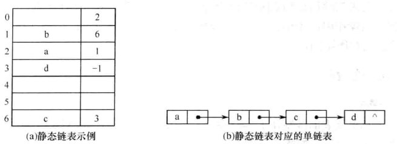

# 线性表

## 一、线性表的定义和基本操作

### 1. 线性表的定义

线性表是具有相同数据类型的n\(n&gt;=0\)个数据元素的有限序列。其中n为表长，当n=0时该线性表是一个空表。若用L命名线性表，其一般表示如下：

$$
L = (a1, a2,  ……, an)
$$

### 2. 线性表的基本操作

基础操作的实现取决于采用哪一种存储结构，存储结构不同，算法的实现也不同。

* InitList\(&L\)
* Length\(L\)
* LocateElem\(L, e\)
* GetElem\(L, i\)
* ListInsert\(&L, i, e\)
* ListDelete\(&L, i, &e\)
* PrintList\(L\)
* Empty\(L\)
* DestroyList\(&L\)

## 二、线性表的顺序实现

### 1. 顺序表的定义

用一组地址连续的存储单元，一次存储线性表中的数据元素，从而使逻辑相邻的两个元素在物理位置上也相邻。一维数组可以是静态分配的，也可以是动态分配的。

```text
//静态分配
#define MaxSize 50                //定义线性表最大容量
typedef struct{
    ElemType data[Maxsize];       //顺序表的元素
    int length;                   //顺序表的当前长度
}SqList;

//动态分配
#define InitSize 100              //表长度的初始定义
typedef struct{
    ElemType *data;               //动态分配数组的指针
    int MaxSize, length;          //数组的最大容量和当前长度
}SqList;
```

顺序表最主要的特点是随机访问，即通过首地址和元素序号可以在O\(1\)的时间找到制定的元素，但是插入和删除操作需要移动大量元素。

### 2. 顺序表上基本操作实现

插入操作：在顺序表L的第 i \(1&lt;=i&lt;=L.length+1\)个位置插入新元素e

```text
bool ListInsert(SqList &L, int i, ElemType e){
    if(i<1 || i>L.length+1)
        return false;
    if(L.length >= MaxSize)
        return false;
    for(j=L.length, j>=i, j--)
        L.data[j] = L.data[j-1];
    L.data[i-1] = e;
    L.length++;
    return true;
}
```

## 三、线性表的链式表示

### 1. 单链表

引入头节点带来的优点：

1. 链表在第一个位置上的操作和在其他位置上的操作一致，无须进行特殊处理
2. 无论链表是否为空，头指针是指向头节点的非空指针

```text
typedef struct LNode{
    ElemType data;        //数据域
    struct LNode *next;   //指针域
}LNode, *LinkList;
```

插入操作：将值为x的新节点插入到单链表的第i个位置上

```text
//先检查位置的合法性
p = GetElem(L, i-1);
s->next = p->next;
p->next = s;
```

删除操作：将单链表的第i个节点删除

```text
//先检查位置的合法性
p = GetElem(L, i-1);
q = p->next;
p->next = q->next;
free(q);
```

### 2. 双链表

双链表在插入和删除操作上和单链表有较大不同，因为需对prior指针做出修改。

```text
typedef struct DNode{
    ElemType data;
    struct DNode *prior, *next;
}DNode, *DLinkList;
```

插入操作：在p所指的结点之后插入结点\*s

```text
s->next = p->next;
s->prior = p;
p->next->prior = s;
p->next = s;
```

删除操作：删除\*p的后继结点\*q

```text
p->next = q->next;
q->next->prior = p;
free(q);
```

### 3. 循环链表

循环单链表：最后一个结点的指针不指向NULL，而改为指向头结点。常对循环单链表设尾指针而不是头指针，当设尾指针r时，r-&gt;next即为头指针，对于表头和表尾进行操作都只需要O\(1\)的时间复杂度。

循环双链表：头结点的prior指针需要指向尾结点；当循环双链表L为空时，其头结点的prior域和next域都等于L。

### 4. 静态链表

借助数组来描述线性表的链式存储结构，与前面链表不同的时指针next指向的是结点的相对地址。在一些不支持指针的高级语言（如Basic）中是一种巧妙的设计方法。



```text
#define MaxSize 50
typedef struct{
    ElemType data;
    int next;
}SLinkList[MaxSize];
```


