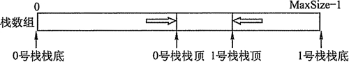

# 栈和队列

## 一、栈

### 1. 栈的基本概念

#### 1.1栈的定义

* 栈：只允许在一端进行插入或删除操作的线性表
* 栈顶：线性表允许插入和删除的那一端
* 栈底：不允许进行插入和删除的另一端
* 空栈：不含任何元素的空表

#### 1.2 栈的基本操作

* InitStack\(&S\)：初始化一个空栈
* StackEmpty\(S\)：判断一个栈是否为空，返回布尔值
* Push\(&S, x\)：进栈，若栈S未满，则将x加入使之成为新栈顶
* Pop\(&S, &x\)：出栈，若栈S非空，弹出栈顶元素，用x返回
* GetTop\(S, &x\)：读栈顶元素，若栈S非空，用x返回栈顶元素
* ClearStack\(&S\)：销毁栈

### 2. 栈的顺序存储结构

#### 2.1 顺序栈的实现

栈的顺序存储称为顺序栈，它利用一组地址连续的存储单元存放自栈底到栈顶的数据元素，同时附设一个指针（Top）指示当前栈顶的位置

```text
#define MaxSize 50
typedef struct{
    Elemtype data[MaxSize];    //存放栈中元素
    int top;                   //栈顶指针
} SqStack
```

* 栈顶指针：S.top，初识时设置 S.top = -1；栈顶元素：S.data\[S.top\]
* 进栈操作：栈不满时，栈顶指针先加1，再送值到栈顶元素
* 出栈操作：栈非空时，先取栈顶元素值，再将栈顶指针减1
* 栈空条件：S.top == -1；栈满条件：S.top == MaxSize - 1；栈长：S.top+1

#### 2.2 顺序栈的基本运算

初始化

```text
void InitStack(&S){
    S.top = -1;
}
```

判断是否为空

```text
bool StackEmpty(S){
    return S.top==-1;
}
```

进栈

```text
bool Push(SqStack &S, Elemtype x){
    if (S.top==MaxSize-1)
        return false;
    S.data[++S.top] = x;
    return true;
}
```

出栈

```text
bool Pop(SqStack &S, Elemtype &x){
    if (S.top==-1)
        return false;
    x = S.data[S.top--];
    return true
}
```

读栈顶元素

```text
bool GetTop(SqStack S, Elemtype &x){
    if (S.top==-1)
        retuen false;
    x = S.data[S.top];
    return true;
}
```

#### 2.3 共享栈

利用栈底位置相对不变的特性，可以让两个顺序栈共享一个一维数据空间，将两个栈的栈底分别设置在共享空间的两端，两个栈顶向共享空间的中间延伸。



top0=-1时0号栈为空，top1=MaxSize时1号栈为空；仅当两个栈顶指针相邻（top1-top0=1）时，判断为栈满；当0号栈进栈时top0先加1再赋值，1号栈进栈时top1先减1再赋值。

### 3. 栈的链式存储结构

采用链式存储的栈成为链栈，链栈的有点是便于多个栈共享存储空间和提高效率，且不存在栈满上溢的情况。通常采用单链表实现，并规定所有操作都是在单链表的表头进行。这里规定链栈没有头结点，Lhead指向栈顶元素


```text
typedef struct Linknode{
    ElemType data;
    struct Linknode *next;
} *LiStack
```

## 二、队列


