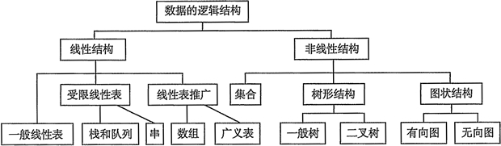

# 绪论

## 一、数据结构的三要素

### 1. 数据的逻辑结构

逻辑结构是指数据元素之间的逻辑关系，即从逻辑关系上描述数据。

### 2. 数据的存储结构

数据的存储结构也称物理结构，是逻辑结构用计算机语言的实现，它依赖于计算机语言。

* 顺序存储：把逻辑上相邻的元素存储在物理位置上也相邻的存储单元里，元素之间的关系由存储单元的邻接关系体现。
* 链式存储：不要求逻辑上相邻的元素在物理位置上也相邻，借助指示元素存储地址的指针表示元素之间的逻辑关系。
* 索引存储：在存储元素信息的同时，还建立附加的索引表（关键字，地址）
* 散列存储：也称Hash存储，根据元素的关键字直接计算出该元素的存储地址。

| 存储结构          | 优点 | 缺点 |
| :--- | :--- | :--- |
| 顺序存储      | 实现随机存取 | 产生外部碎片 |
| 链式存储 | 不会产生碎片 | 因存储指针占用额外空间，且只能实现顺序存取 |
| 索引存储 | 检索速度快 | 附加的索引表占用较多的存储空间，增删时修改索引表花费时间 |
| 散列存储 | 检索、增加和删除都很快           | 散列函数不好可能会导致元素存储单元冲突 |

## 二、算法效率的度量

### 1. 时间复杂度

加法规则：

$$
T(n)=T1(n)+T2(n)=O(f(n))+O(g(n))=O(max(f(n),g(n)))
$$

乘法规则：

$$
T(n)=T1(n)*T2(n)=O(f(n))*O(g(n))=O(f(n)*g(n))
$$

### 2. 空间复杂度

算法的空间复杂度S\(n\)，定义为该算法所耗费的存储空间，它是问题规模n的函数。算法原地工作是指算法所需辅助空间是常量，即O\(1\)。

